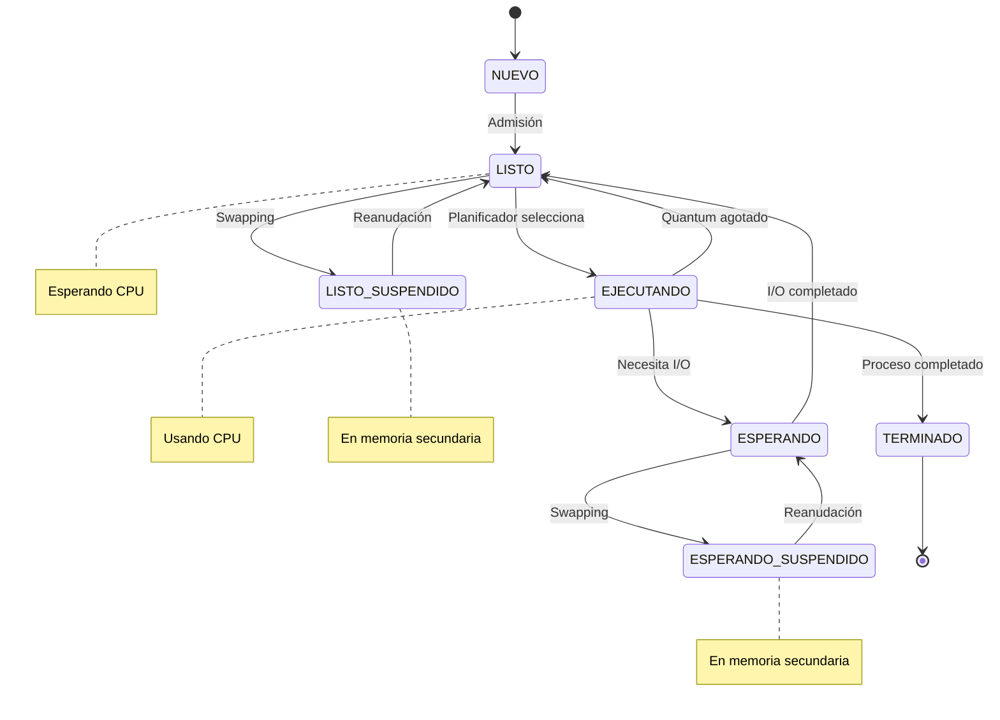

# Simulador de Estados de Procesos

Este laboratorio implementa un simulador de estados de procesos en un sistema operativo, demostrando el ciclo de vida de los procesos y sus transiciones entre diferentes estados.

## Características

- Simulación de estados de procesos (NUEVO, LISTO, EJECUTANDO, ESPERANDO, TERMINADO)
- Estados suspendidos (LISTO-SUSPENDIDO, ESPERANDO-SUSPENDIDO)
- Planificación Round-Robin con quantum configurable
- Simulación de operaciones de I/O
- Visualización en tiempo real de estados y métricas
- Estadísticas detalladas de rendimiento

## Requisitos

- Python 3.7 o superior
- Biblioteca Rich para la interfaz de consola

## Instalación

Instalar dependencias:

```bash
pip install -r requirements.txt
```

## Uso

Para ejecutar la simulación:

```bash
python main.py
```

## Configuración

Puedes modificar los siguientes parámetros en `main.py`:

- `QUANTUM`: Tiempo de quantum para el algoritmo Round-Robin
- `CICLOS`: Número de ciclos de simulación
- `CANTIDAD_PROCESOS`: Número de procesos a simular

## Estructura del Proyecto

```
simulador_procesos/
├── proceso.py          # Clase Proceso y estados
├── planificador.py     # Lógica de scheduling
├── simulador.py        # Motor de simulación
├── interfaz.py         # Visualización en consola
├── main.py             # Punto de entrada
├── requirements.txt    # Dependencias
└── README.md           # Documentación
```

## Estados de Procesos

- **NUEVO**: Procesos recién creados
- **LISTO**: Procesos preparados para ejecutar
- **EJECUTANDO**: Proceso actualmente usando la CPU
- **ESPERANDO**: Procesos bloqueados por I/O
- **TERMINADO**: Procesos que completaron su ejecución
- **LISTO-SUSPENDIDO**: Procesos listos pero suspendidos
- **ESPERANDO-SUSPENDIDO**: Procesos esperando pero suspendidos

## Métricas

El simulador proporciona las siguientes métricas:

- Tiempo de espera promedio
- Tiempo de respuesta promedio
- Throughput: cantidad de procesos que se completan exitosamente por unidad de tiempo

## Diagrama de Estados


